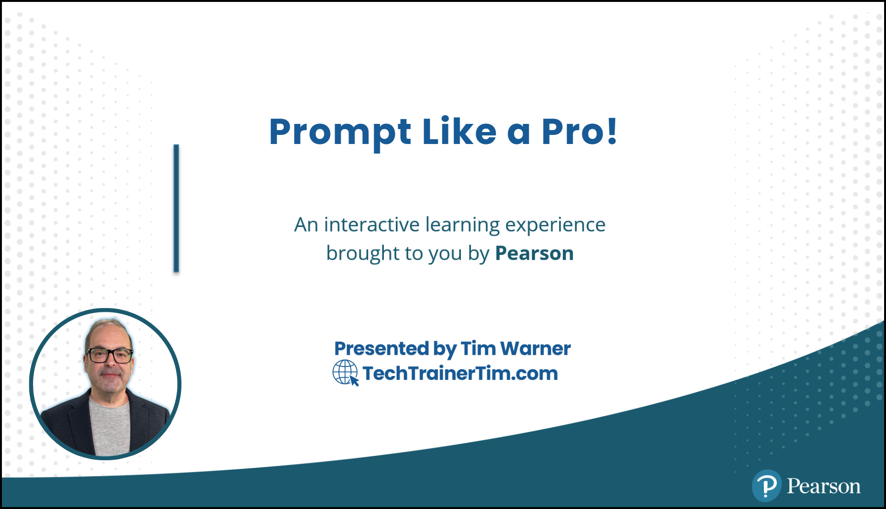

# How to Prompt Like a Pro: Master AI for Business Innovation



Welcome to the training hub for **"How to Prompt Like a Pro"** - an O'Reilly Live Learning course that teaches business professionals how to extract maximum value from AI tools like ChatGPT, Claude, Microsoft 365 Copilot, and Google Gemini. Master the art of prompt engineering to accelerate innovation, productivity, and decision-making.

👉 **New to prompting?** Start with our [Core Prompting Guide](segments/segment-1-core-prompting/README.md)!
📋 **Looking for frameworks?** Check out our [Prompt Frameworks Library](resources/frameworks.md)!

*Last updated: August 2025*

---

## 📬 **Contact Information**
- **[GitHub](https://github.com/timothywarner)**
- **[GitHub Organization](https://github.com/timothywarner-org)**
- **[LinkedIn](https://www.linkedin.com/in/timothywarner/)**
- **[YouTube Channel](https://www.youtube.com/channel/UCim7PFtynyPuzMHtbNyYOXA)**
- **[Website](https://techtrainertim.com)**
- **[Bluesky](https://bsky.app/profile/techtrainertim.bsky.social)**
- **[Mastodon](https://mastodon.social/@techtrainertim)**

---

## 📆 **Course Plan Overview**
This live training is structured into 4 segments, each approximately 50 minutes:

1. **Core Prompting Skills for Reliable AI Results**
   - Essential prompt-writing techniques proven across industries
   - Common prompt pitfalls and how to avoid them
   - Evergreen, reusable prompt recipes for immediate improvement

2. **Multimodal Prompting—Beyond Text**
   - Effective prompts for ChatGPT Vision, Sora, and Midjourney
   - Quick-win visual prompting formulas
   - Applications for presentations, marketing, medical imagery, and legal visuals

3. **AI Notebooks for Better Insights and Decisions**
   - NotebookLM, ChatGPT, and Claude workflows
   - Prompting for clearer analysis and reporting
   - Hands-on notebook techniques for business contexts

4. **Advanced Prompting and Agentic AI**
   - Automation with GitHub Copilot, Cursor, Windsurf, and Cline
   - RAG and Model Context Protocol (MCP) implementation
   - Strategies for reliable, hallucination-free results

💡 **Each segment includes interactive Q&A and hands-on demonstrations!**

---

## 🎯 **Learning Outcomes**

### What You'll Understand
- How prompt engineering directly improves your business outcomes with AI
- Which prompt-writing techniques deliver the best results in real-world tasks
- How to avoid common prompt pitfalls that waste time or limit usefulness

### What You'll Be Able to Do
- Write clear, useful prompts quickly and confidently
- Improve the accuracy and reliability of AI-generated business content
- Integrate effective prompt practices into your daily work using the best tools for the job

---

## 👥 **Who Should Attend**
- Business professionals seeking more practical value from AI
- Regular users of AI tools for writing, analysis, marketing, or management
- Anyone who needs straightforward strategies to improve AI-generated results immediately
- No coding or deep technical background required!

---

## 🚀 **The Good Stuff: Essential Resources**

### Core Materials
- [Real-World Prompting Examples](resources/examples/real-world-prompts.md)
- [Prompting Frameworks and Templates](resources/frameworks.md)
- [DAIR.AI Prompting Introduction](resources/guides/dair-ai/prompts-intro.md)
- [DAIR.AI Advanced Prompts](resources/guides/dair-ai/prompts-advanced-usage.md)
- [OpenAI Reliability Techniques](resources/guides/openai-cookbook/techniques-to-improve-reliability.md)

### Segment Resources
- [Segment 1: Core Prompting](segments/segment-1-core-prompting/)
- [Segment 2: Multimodal Prompting](segments/segment-2-multimodal-prompting/)
- [Segment 3: AI Notebooks](segments/segment-3-ai-notebooks/)
- [Segment 4: Agentic AI & MCP](segments/segment-4-agentic-ai/)

---

## 🛠️ **Course Setup & Prerequisites**

### Basic Requirements
- Internet connection
- Google account (for free AI service signups)
- ChatGPT free account (required)
- Basic familiarity with tools like ChatGPT or Bing Chat

### Optional Accounts for Full Experience
- Google Gemini
- NotebookLM
- Claude
- Midjourney
- Microsoft 365 Copilot (if available through your organization)

### For Advanced Segment (MCP)
- GitHub account
- Azure subscription (free tier OK)
- VS Code with GitHub Copilot
- Node.js 20+ or Python 3.11+

---

## 📚 **Prompting Frameworks Quick Reference**

### CRAFT Framework
**C**ontext, **R**ole, **A**ction, **F**ormat, **T**one
- Template: "You are a {role}. {Action}. Respond in {format} with a {tone} tone. Context: {context}."

### CLEAR Framework
**C**ontext, **L**ength, **E**xamples, **A**nswer format, **R**efine
- Template: "Given {context}, provide {answer format} in about {length}. Examples: {examples}."

### RAPID Framework
**R**ole, **A**ction, **P**arameters, **I**nput data, **D**esired format
- Template: "You are a {role}. Using {input data}, {action}. Parameters: {parameters}."

[View all frameworks →](resources/frameworks.md)

---

## 🎓 **Recommended Preparation**

### Books
- [Quick Start Guide to Large Language Models](https://learning.oreilly.com/library/view/-/9780138199425/) by Sinan Ozdemir
- [The AI Revolution in Medicine: GPT-4 and Beyond](https://learning.oreilly.com/library/view/-/9780138200145/)

### Follow-up Resources
- [Beyond the Algorithm: AI, Security, Privacy, and Ethics](https://learning.oreilly.com/library/view/-/9780138268442/)
- [Responsible AI: Best Practices for Creating Trustworthy AI Systems](https://learning.oreilly.com/library/view/-/9780138073947/)

---

## 💡 **Best Practices for Business Prompting**

### The Golden Rules
1. **Start simple** - Complex prompts often fail more than simple ones
2. **Be specific** - Vague prompts get vague results
3. **Use examples** - Few-shot prompting is incredibly powerful
4. **Test iteratively** - Small changes can have big impacts
5. **Context is king** - Provide relevant background information

### Industry-Specific Tips

#### For Marketing & Content
- Include target audience details
- Specify tone and brand voice
- Provide successful examples

#### For Analysis & Reporting
- Define metrics clearly
- Request structured outputs
- Ask for reasoning steps

#### For Healthcare & Legal
- Emphasize accuracy requirements
- Request citations when applicable
- Include compliance considerations

---

## 🔧 **AI Tools Covered**

### Primary Tools (Hands-on Demos)
- **ChatGPT** - OpenAI's conversational AI
- **Microsoft 365 Copilot** - AI integrated into Office apps
- **Google Gemini** - Google's multimodal AI
- **Claude** - Anthropic's helpful assistant

### Visual AI Tools
- **ChatGPT Vision** - Image understanding
- **Midjourney** - Creative image generation
- **DALL-E** - OpenAI's image creator
- **Sora** - Video generation (when available)

### Developer Tools (Segment 4)
- **GitHub Copilot** - AI pair programming
- **Cursor** - AI-powered code editor
- **Windsurf** - Next-gen development
- **Cline** - Autonomous coding agent

### Specialized Platforms
- **NotebookLM** - Google's research assistant
- **Perplexity** - AI-powered search
- **Azure OpenAI** - Enterprise AI platform

---

## 🚀 **Advanced Topics: Model Context Protocol (MCP)**

### What is MCP?
Model Context Protocol is the production-ready solution adopted by Anthropic and Microsoft for persistent AI memory. In Segment 4, you'll learn:

- How to deploy MCP servers on Azure
- Connecting AI tools to GitHub for long-term memory
- Building enterprise-grade memory systems
- Multi-agent orchestration patterns

### MCP Resources
- [MCP Course Proposal](tim/mcp-proposal.md)
- [Anthropic MCP Documentation](https://docs.anthropic.com/mcp)
- GitHub Repository: `timothywarner-org/context-engineering`

---

## 🎯 **Quick Start Exercises**

### Exercise 1: Your First Professional Prompt
```
Role: You are a business analyst
Task: Summarize the following data
Format: Executive summary with 3 key insights
Tone: Professional and concise
Data: [Your data here]
```

### Exercise 2: Multimodal Marketing
```
Create a social media campaign for [product].
Include: 
- 3 image prompts for Midjourney
- 5 post captions
- Optimal posting schedule
Target audience: [Your audience]
```

### Exercise 3: Analysis with NotebookLM
1. Upload your documents to NotebookLM
2. Ask: "What are the top 3 trends in this data?"
3. Request: "Create an FAQ based on this content"
4. Generate: "Build a study guide from these materials"

---

## 📱 **Community & Support**

### AI Communities
- [OpenAI Community Forum](https://community.openai.com/)
- [Anthropic Discord](https://discord.gg/anthropic)
- [Microsoft AI Community](https://techcommunity.microsoft.com/t5/ai/ct-p/AI)

### Learning Resources
- [Prompting Guide](https://www.promptingguide.ai/)
- [Learn Prompting](https://learnprompting.org/)
- [OpenAI Cookbook](https://cookbook.openai.com/)

### Tim's Resources
- [GitHub Organization](https://github.com/timothywarner-org)
- [YouTube Channel](https://www.youtube.com/channel/UCim7PFtynyPuzMHtbNyYOXA)
- [Tech Trainer Tim Website](https://techtrainertim.com)

---

## 🛡️ **Ethical AI & Best Practices**

### Responsible AI Use
- Always verify AI-generated content for accuracy
- Respect intellectual property and attribution
- Consider bias in AI responses
- Protect sensitive data - never share PII with AI

### Business Considerations
- Establish AI usage policies for your organization
- Document AI-assisted work appropriately
- Understand your tools' data retention policies
- Consider compliance requirements (GDPR, HIPAA, etc.)

---

## 📊 **Measuring Success**

### Key Performance Indicators
- **Time saved** on content creation and analysis
- **Quality improvement** in outputs
- **Consistency** across team deliverables
- **Innovation** in problem-solving approaches

### Success Stories
- Marketing teams reducing campaign creation time by 60%
- Analysts producing reports 3x faster
- Customer service improving response quality scores by 40%
- Legal teams accelerating document review by 50%

---

## 🎬 **Course Wrap-up Resources**

### Your Toolkit
After completing this course, you'll have:
- ✅ Prompt templates for common business tasks
- ✅ Framework cheat sheets for quick reference
- ✅ Industry-specific prompt examples
- ✅ MCP implementation templates (Segment 4)
- ✅ Best practices documentation

### Next Steps
1. **Practice daily** - Use AI tools in your regular workflow
2. **Experiment** - Try new prompting techniques
3. **Share** - Teach colleagues what you've learned
4. **Stay updated** - AI capabilities evolve rapidly

---

## 📄 **License & Contributing**

This project is licensed under the [MIT License](LICENSE).

### Contributing
Please see [CONTRIBUTING.md](CONTRIBUTING.md) for guidelines on how to contribute.

### Code of Conduct
Participation in this project is governed by the [Code of Conduct](CODE_OF_CONDUCT.md).

---

This course repository is actively maintained and updated with the latest AI prompting techniques and tools. For questions, suggestions, or corrections, feel free to reach out via the contact information above.

**Ready to prompt like a pro? Let's transform how you work with AI!** 🚀