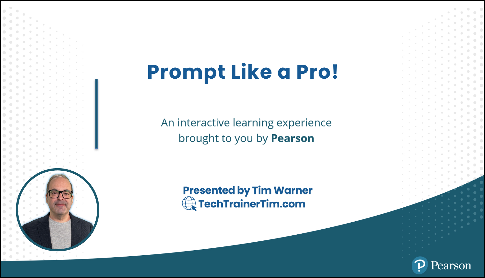

# How to Prompt Like a Pro: Master AI for Business Innovation

[](https://techtrainertim.com)
[](https://github.com/timothywarner)
[](https://www.linkedin.com/in/timothywarner/)



An **O'Reilly Live Learning** course teaching business professionals how to extract maximum value from AI tools like Microsoft 365 Copilot, ChatGPT, Claude, and Google Gemini.

*Last updated: April 2026*

---

## Course Segments

| # | Segment | Duration | Key Topics |
|---|---------|----------|------------|
| 1 | [**Identity, Mindset & Context Foundations**](segments/segment-1-identity-mindset-context/) | 50 min | Pilot/copilot, anchor trap, prompt smell, context disclosure, inference |
| 2 | [**Context Sculpting & Prompting Technique**](segments/segment-2-context-sculpting-technique/) | 50 min | Role-play, task decomposition, few-shot, chain-of-thought, meta-prompting |
| 3 | [**Workflow, Multimodal & Security**](segments/segment-3-workflow-multimodal-security/) | 50 min | Custom instructions, prompt versioning, voice, cross-referencing, privacy |
| 4 | [**Agentic Orchestration & Resilience**](segments/segment-4-agentic-orchestration/) | 50 min | LLM matching, subagents, checkpoints, MCP, Copilot Studio, breaking changes |

---

## Warner's Laws of Generative AI Prompting

1. You are the pilot; the AI is your co-pilot. You're responsible for its actions.
2. Always know who you're signed in as and who you're chatting with.
3. Beware the anchor trap — draft before you prompt.
4. Trust your gut — never hesitate to second-guess the AI.
5. Every AI chat has its own lifecycle; develop your "prompt smell."
6. The more you disclose in trust, the more the AI can help you.
7. Anything you leave out of your prompt will be inferred by the AI.
8. Surgically sculpt your context. Just because you can doesn't mean you should.
9. Role play like you're a director.
10. Don't swallow the elephant — break down complex tasks with the AI.
11. Show, don't tell — lead with examples.
12. Make the AI show its work.
13. Think meta: prompt about prompting and custom instructions.
14. Strike while the iron's hot.
15. If you need to remind the AI of something, add it to custom instructions.
16. Periodically refactor your custom instructions and memories.
17. Treat prompts as assets — version-control them.
18. Use your voice if using words is difficult.
19. Pick up a good book on technical writing.
20. Always have a trusted LLM to cross-reference responses.
21. Protect your LLM against abuse by integrating test prompts.
22. Protect privacy ruthlessly. Know your chat storage, licensing, and data retention.
23. Each LLM has its own personality. Match the tool to the task.
24. Orchestrate subagents as force multipliers. Use git worktrees for parallelism.
25. Checkpoint before consequence — autonomous does not mean unsupervised.
26. Expect breaking changes. Stay agile, adaptable, and be an eternal learner.

---

## Context Engineering vs Prompt Engineering

| Prompt Engineering | Context Engineering |
|---|---|
| Focus on *what to say* | Focus on *what the model knows* |
| One-off interactions | System-wide reliability |
| Phrasing and examples | Everything in the context window |

**Key Insight:** Most AI failures aren't model failures—they're context failures.

---

## Tools Covered

### Primary Platforms
- **Microsoft 365 Copilot** — Notebooks, Agents, enterprise integration
- **ChatGPT** — Projects, Custom GPTs, DALL-E 3, Vision
- **Google Gemini** — Gems, Imagen 3, 1M+ token context
- **Claude** — Projects, long-form analysis, Claude Code

### Agentic AI
- **Claude Code** — Terminal-based autonomous coding with checkpoints
- **GitHub Copilot Coding Agent** — Issue-to-PR cloud automation
- **M365 Copilot Studio** — Enterprise multi-agent orchestration
- **Azure AI Foundry** — Azure-hosted model deployment and orchestration

---

## Prerequisites

### Required
- Internet connection
- ChatGPT free account
- Google account

### Recommended
- Microsoft 365 Copilot license
- Claude Pro
- GitHub Copilot subscription
- VS Code

---

## Quick Start

### CRAFT Framework
```text
Context: [situation]
Role: You are a [role]
Action: [task]
Format: [output format]
Tone: [voice/style]
```

### Example Prompt
```text
Context: I'm preparing a quarterly business review for my VP.
Role: You are a senior business analyst.
Action: Analyze this sales data and identify the top 3 trends.
Format: Executive summary with bullet points, max 200 words.
Tone: Professional and data-driven.
```

---

## Repository Structure

```
docs/                               # Reference guides + slide deck
images/                             # Cover art, social preview assets
segments/
├─ segment-1-identity-mindset-context/      # Laws 1-7, anchor trap, context foundations
├─ segment-2-context-sculpting-technique/   # Laws 8-14, few-shot, chain-of-thought
├─ segment-3-workflow-multimodal-security/  # Laws 15-22, versioning, privacy
└─ segment-4-agentic-orchestration/         # Laws 23-26, subagents, MCP demos
.github/                            # Issue templates, workflows, AI instructions
COURSE-PLAN-APRIL-2026.md          # April 2026 delivery plan
```

**For instructors:** See [INSTRUCTOR-MANIFEST.md](docs/INSTRUCTOR-MANIFEST.md) for delivery guide.  
**For agents:** Review [AGENTS.md](AGENTS.md) and [CLAUDE.md](CLAUDE.md) before editing lessons.

---

## Resources

- [Anthropic Context Engineering Guide](https://www.anthropic.com/engineering/effective-context-engineering-for-ai-agents)
- [OpenAI Prompt Engineering Guide](https://platform.openai.com/docs/guides/prompt-engineering)
- [GitHub Copilot Custom Instructions](https://docs.github.com/en/copilot/customizing-copilot/adding-repository-custom-instructions-for-github-copilot)
- [MCP Specification](https://spec.modelcontextprotocol.io/)

---

## License & Contributing

Licensed under [MIT](LICENSE). See [CONTRIBUTING.md](CONTRIBUTING.md) for guidelines and [AGENTS.md](AGENTS.md) for the agent-focused repository playbook.

### Code of Conduct
Participation in this project is governed by the [Code of Conduct](CODE_OF_CONDUCT.md).

### Security
Found a vulnerability or risky prompt scenario? Follow the disclosure steps in [SECURITY.md](SECURITY.md) or email Tim directly at `tim@techtrainertim.com`.

---

## Repo Guides & Automation

- [AGENTS.md](AGENTS.md) - Contributor playbook
- [CLAUDE.md](CLAUDE.md) - Copilot instructions
- [INSTRUCTOR-MANIFEST.md](docs/INSTRUCTOR-MANIFEST.md) - Run-of-show notes
- [COURSE-PLAN-APRIL-2026.md](COURSE-PLAN-APRIL-2026.md) - April 2026 delivery plan
- [markdownlint.json](markdownlint.json) & [Markdownlint workflow](.github/workflows/markdownlint-autofix.yml) - spacing rules + one-click lint/autofix

---

**Ready to prompt like a pro? Let's transform how you work with AI!**
